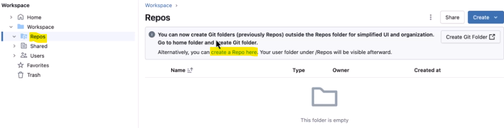
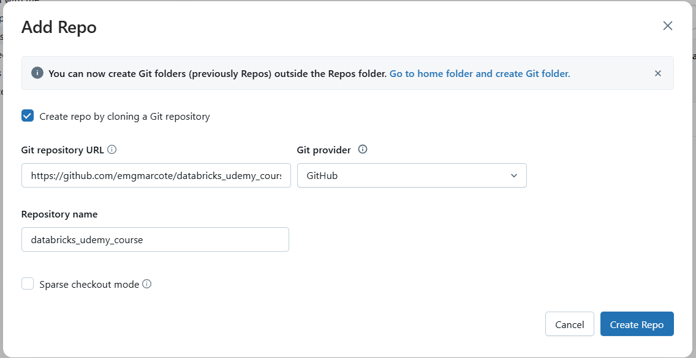
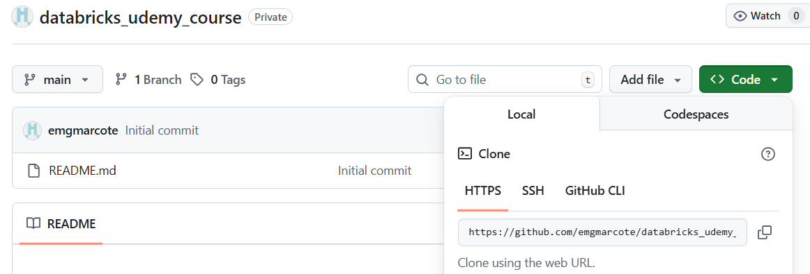
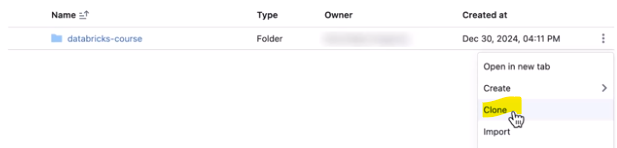
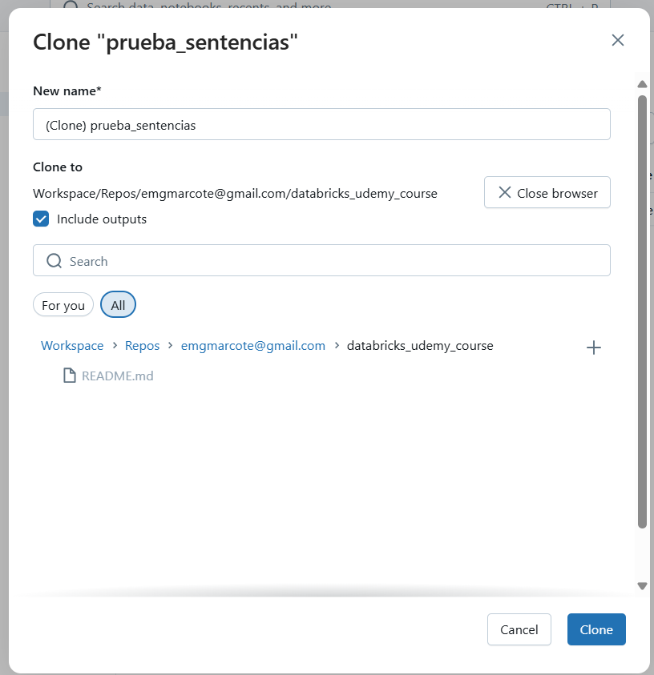
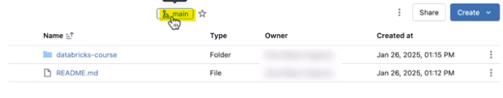
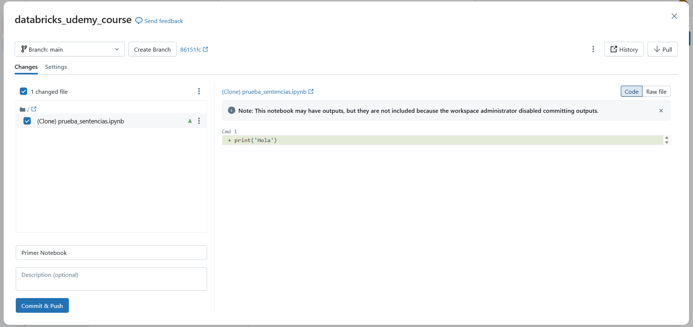
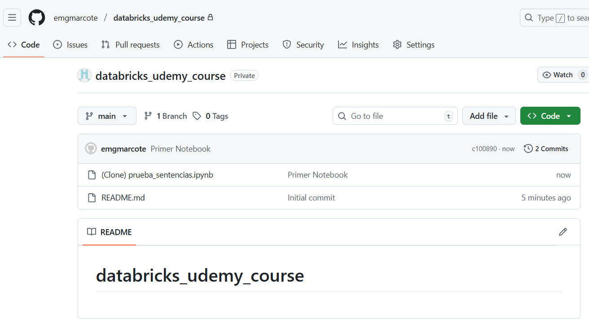

# Tutorial de cómo conectar Databricks a un repositorio Gitub

Let's discover **Docusaurus in less than 5 minutes**.

## Creación de un token personal en tu github

Vamos a Settings y Developer Setting, en el submenú "personal access tokens" le damoa a generar nuevo token de tipo clasico

## Añadirlo como linked accounts

Si vamos al perfil, settings, user y linked accounts
**git provider:** GitHub y cogemos la opción de "Personal token"
**username:** Ponemos el usuario de nuestra cuenta de GitHub
**token:** Ponemos el token que creamos anteriormente

## Creamos el repositorio en gitHub y databricks

Vamos a gitHub y creamos el repositorio añadiendo el archivo Readme para que se genere la rama main.

Vamos ahora a Databricks, vamos a Workspace en el menú vertical. Se abre la sección de carpetas y dentro de Workspace y Repos, hacemos click en "Create Repo Here"

Se abre la siguiente ventana donde nos pide la url del repositorio de github

que podemos consultar en

## Clonar el proyecto de Databricks al repositorio

Vamos a Home, a nuestro proyecto y en el menú de los 3 puntos escogemos la opción de "clonar"

Por defecto nos saldrá una carpeta de databricks pero buscaremos nosotros la carpeta del repositorio y en concreto el repositorio que creamos antes y le damos a "clonar".

Con este paso veremos la carpeta del proyecto dentro de "repositorio" en databricks pero todavía no estaría en GitHub, será necesario hacer el commit y push.

## Subir los cambios a GitHub

Vamos a "main" desde la carpeta del repositorio

Se abre una nueva ventana donde se pueden ver en la izquierda los cambios realizados y por defecto están seleccionados
Ponemos el comentario del commit, la descripcion no es obligatoria y le damos a "Commit&Push" y ahora ya podemos comprobar que ya están en GitHub

Podemos ver ahora que ya se ven los cambios en GitHub

